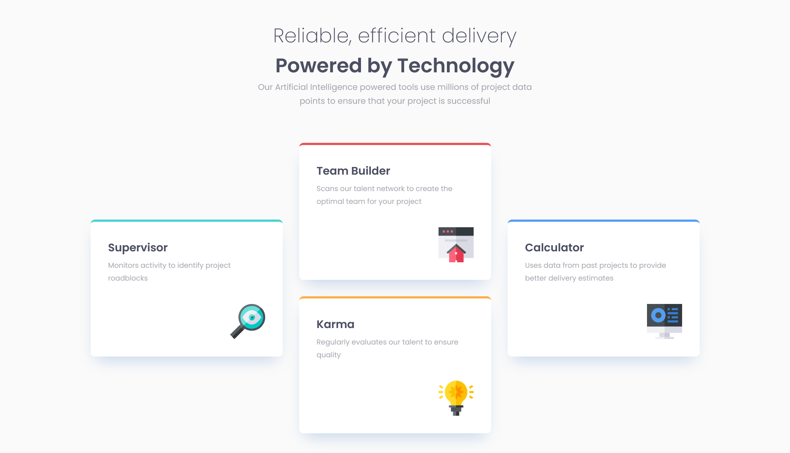

# Frontend Mentor - Four card feature section solution

This is a solution to the
[Four card feature section challenge on Frontend Mentor](https://www.frontendmentor.io/challenges/four-card-feature-section-weK1eFYK).

## Table of contents

- [Overview](#overview)
  - [The challenge](#the-challenge)
  - [Screenshot](#screenshot)
  - [Links](#links)
- [My process](#my-process)
  - [Built with](#built-with)
  - [What I learned](#what-i-learned)
  - [Continued development](#continued-development)
  - [Useful resources](#useful-resources)
- [Author](#author)
- [Acknowledgments](#acknowledgments)

## Overview

### The challenge

Users should be able to:

- View the optimal layout for the site depending on their device's screen size

### Screenshot

### Links

- Solution URL: [Github](https://github.com/LuisVera1/FrontendMentor-Four-card-feature-section)
- Live Site URL: [Live solution](https://frontend-mentor-four-card-feature-section-three-omega.vercel.app/)

## My process

### Built with

- Semantic HTML5 markup
- CSS custom properties
- Flexbox
- Mobile-first workflow
- [React](https://reactjs.org/) - JS library

### What I learned

Some time ago, I began this project from Frontend Mentor as a trial for Flexbox. However, I never got around to completing it.

Recently, I noticed that this unfinished challenge was still among my projects. Motivated by this realization, I decided to finally tackle it, striving for the closest possible match to the original design.

I used this project to experiment, I thought to do it with grid, but finally I
used flexbox to explore new ways, anyway I'm happy with the result.

### Continued development

I will continue to experiment and improve the structure of my code to make it
more maintainable.

## Author

- Website - [Luisvera.dev](https://www.luisvera.dev)
- Frontend Mentor -
  [@LuisVera1](https://www.frontendmentor.io/profile/LuisVera1)

## Acknowledgments

Thanks to Frontend Mentor! 👍🏻
